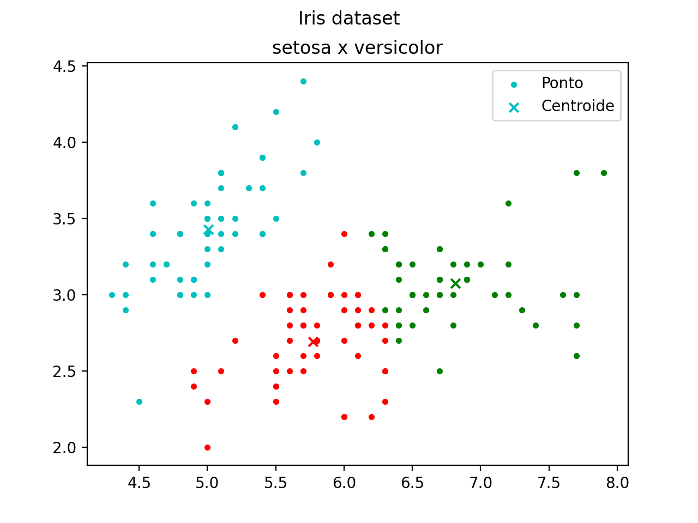
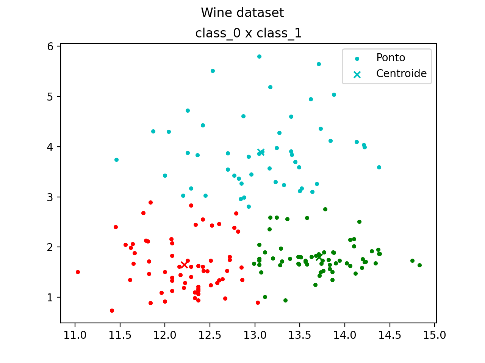
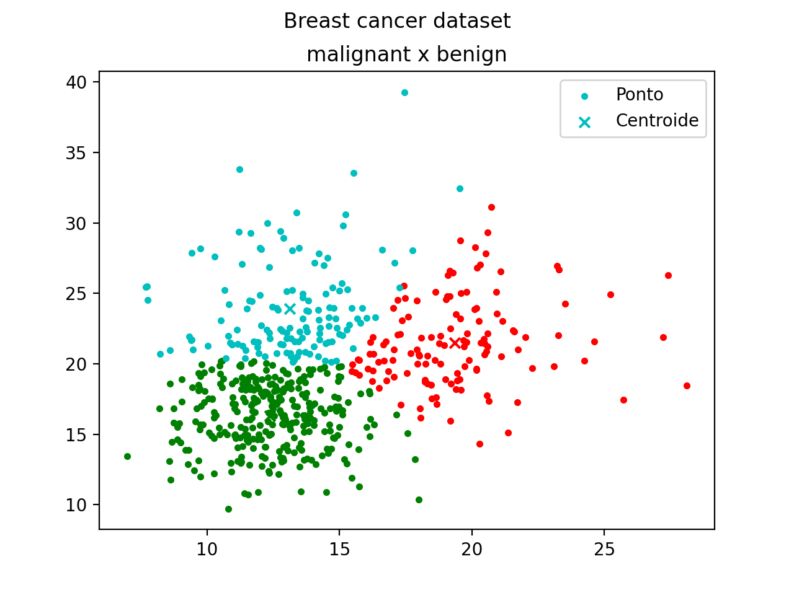

# K-Means
Implemetação em Python do algoritmo k-means.

Para essa implementação, foram utilizadas as seguintes bases de dados:
+ [Iris](https://archive.ics.uci.edu/ml/datasets/Iris)
+ [Wine](https://archive.ics.uci.edu/ml/datasets/Wine)
+ [Breast Cancer](https://archive.ics.uci.edu/ml/datasets/Breast+Cancer+Wisconsin+%28Diagnostic%29)

Por fim, as seguintes bibliotecas foram utilizadas:
+ **Numpy** para operações matemáticas como multiplicação de matrizes
+ **Sklearn** para importação das bases de dados

## Resultados
Abaixo, seguem os resultados gerados pela presente implementação do k-means

