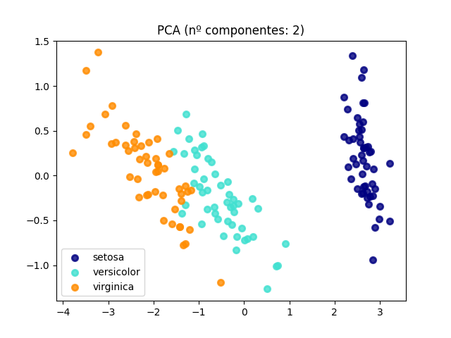
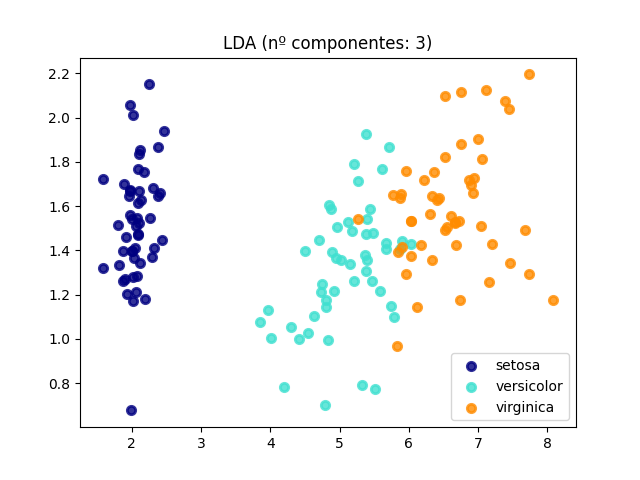

# PCA e LDA

Implementação das análises PCA e LDA.

Foi utilizado numpy para manipulações de matrizes e o [dataset iris](https://scikit-learn.org/stable/auto_examples/datasets/plot_iris_dataset.html?highlight=iris), disponível na biblioteca scikit.

## Resultados
Abaixo, segue uma tabela comparando os gráficos gerados pelas classificações com PCA e com LDA. 

PCA  | LDA
------------- | -------------
  | 
  | 